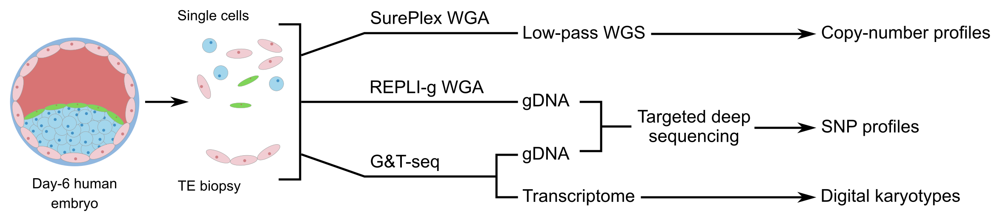

Frequent loss-of-heterozygosity in CRISPR-Cas9-edited early human
embryos
================
Gregorio Alanis-Lobato, Human Embryo and Stem Cell Lab, The Francis
Crick Institute

## About this repository

CRISPR-Cas9 genome editing is a promising technique for clinical
applications, such as the correction of disease-associated alleles in
somatic cells. The use of this approach has also been discussed in the
context of heritable editing of the human germline. However, studies
assessing gene correction in early human embryos report low efficiency
of mutation repair, high rates of mosaicism and the possibility of
unintended editing outcomes that may have pathologic consequences. We
developed computational pipelines to assess single cell genomics and
transcriptomics datasets from OCT4 (*POU5F1*) CRISPR-Cas9-targeted, Cas9
and uninjected control human preimplantation embryos. This allowed us to
evaluate on-target mutations that would be missed by more conventional
genotyping techniques. This GitHub repository contains the scripts that
we implemented to carry out these analyses.

## Inputs and outputs

The following figure shows the different datasets that we analysed and
the outputs that were produced with the pipelines listed below. Briefly,
low-pass whole genome sequencing (WGS) data from OCT4-targeted, Cas9 and
uninjected control single cells or trophectoderm (TE) biopsies from
human embryo samples were used to generate copy-number profiles. The
genomic DNA (gDNA) isolated from single cells or TE biopsies subjected
to the G\&T-seq protocol (short for single cell genome and transcriptome
sequencing) or to whole genome amplification (WGA) was used for targeted
deep sequencing of 15 PCR amplicons across the *POU5F1* locus. We took
advantage of the high coverage obtained at each of the sequenced
amplicons to call single nucleotide polymorphisms (SNPs) and generate
SNP profiles for each sample. Finally, the gene expression data from the
G\&T-seq samples were used to generate transcriptome-based digital
karyotypes.

## Pipelines

The scripts associated with each pipeline have been organised in
different folders. Each script contains example execution guidelines.

### Copy-number profiles from low-pass WGS data

Low-pass WGS samples were aligned to the human genome hg19 using BWA
version 0.7.17 and the copy-number profiles were generated with the R
package QDNAseq version 1.24.0 using bins of size 100kb.

The corresponding scripts are inside the `lowpassWGS` folder and must be
executed in the following order to generate a copy-number profile for
each sample:

  - align\_lowpassWGS.sh
  - generate\_CNP.R

### SNP profiles from deep amplicon sequencing data

Deep amplicon sequencing paired-end reads were trimmed with DADA2 to
remove low-quality regions. Then, we corrected substitution errors in
the trimmed reads with RACER and mapped the corrected reads to the human
genome hg38 with BWA version 0.7.17 in multi-threaded mode using the
`mem` algorithm with default settings. Subsequently, SAM files were
converted to the BAM format and post-processed (sorting, indexing and
mate fixing) using Samtools version 1.3.1. SNP calling was performed
with BCFtools version 1.8 using the `mpileup` (`--max-depth 2000 -a
'AD,DP,ADF,ADR' -Ou`) and `call` (`-mv -V 'indels' -Ov`) algorithms in
multi-threaded mode. SNPs supported by less than 10 reads and with
mapping quality below 50 were filtered out. To control for allele
overamplification, we revisited the homozygous SNP calls in search for
reads supporting the reference allele at those positions. We changed
these homozygous SNPs to heterozygous if the fraction of reads
supporting the reference allele was at least 6% of the total. This
threshold corresponds to the median of the distribution of the fraction
of reads supporting the reference allele across samples.

The corresponding scripts are inside the `ampliconSeq` folder and must
be executed in the following order to generate a VCF file per sample
containing its SNP profile:

  - check\_fastq\_quality.R
  - trim\_and\_filter.R
  - correct\_fastq.sh
  - call\_snps.sh
  - correct\_amp\_bias.R

The resulting VCF files can be explored with, for example, the
Integrative Genomics Viewer.

### Digital karyotypes from gene expression data

For transcriptome-based digital karyotyping, we used the data deposited
in the GEO repository under accession GSE100118. We applied two
approaches to this dataset: z-score karyotyping \[Groff *et al.* Genome
Res. 29:1705-1718\] and eSNP-Karyotyping \[Weissbein *et al.* Nature
Communications 7:12144\].

We only provide scripts for z-score karyotyping in the `digitalKaryo`
folder:

  - z\_scr\_karyo.R

eSNP-karyotyping can be installed and applied to your data following the
instructions in the following GitHub repository:

  - <https://github.com/BenvenLab/eSNPKaryotyping>

Note that z-score karyotyping was applied to the processed gene
expression matrix provided at the GEO, while eSNP-Karyotyping was
applied directly to the FastQ files. We used version 0.6.5 of [Trim
Galore\!](https://www.bioinformatics.babraham.ac.uk/projects/trim_galore/)
on the raw FastQ files for quality and adapter trimming before the
application of eSNP-Karyotyping.

## Last compiled

This document was knitted on 22 September 2020.
